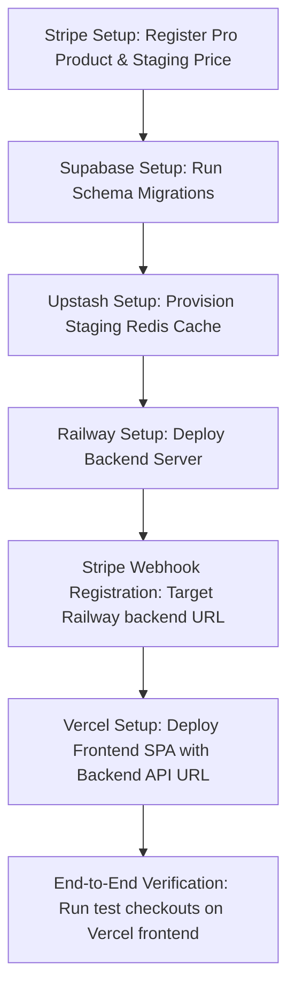

# Deploy Readiness Audit Report — EngineerOS v2

Audit Date: **2026-07-03**  
Target Branch: `release/v1.0.0-rc1`  
Deployment Status: **FAIL / BLOCKED**

---

## 🚦 PASS / FAIL Verification

| Scope                            |  Status  | Notes                                                                                       |
| :------------------------------- | :------: | :------------------------------------------------------------------------------------------ |
| **Railway backend entrypoint**   | **PASS** | `server.js` points to `src/app.js` and starts Express.                                      |
| **Railway health endpoint**      | **PASS** | `GET /api/health` returns status metadata successfully.                                     |
| **Railway start command**        | **PASS** | Command `node server.js` runs via npm scripts.                                              |
| **Vercel build command**         | **PASS** | `npm run build` runs `vite build` to generate compiled static assets.                       |
| **Vercel output directory**      | **PASS** | Outputs static bundles to `/dist` correctly.                                                |
| **Vercel SPA routing**           | **PASS** | `vercel.json` redirects and rewrites all route traffic to `index.html`.                     |
| **Stripe parameters**            | **PASS** | Webhook handles raw buffer; checkout/portal endpoints support dynamic origins.              |
| **Supabase security boundaries** | **PASS** | Service role client is locked to backend database repository. RLS migration files verified. |
| **Upstash limit adapters**       | **PASS** | Production mode requires Upstash configuration for rate limit persistence.                  |

---

## 🚫 Critical Blockers

1.  **Railway CLI Authentication:** Staging/Production project not instantiated. Deployment command blocked.
2.  **Vercel Deployment Key:** Frontend account workspace integration missing.
3.  **Stripe webhook secret:** Stripe test/production webhook endpoint cannot be registered until Railway server URL is live.
4.  **Supabase project link:** Migration deployment blocked due to lack of target database URL and API keys.

---

## 📋 Recommended Environment Variables

### Backend Staging / Production (`Railway`)

```ini
PORT=8080
NODE_ENV=production
APP_ORIGIN=https://engineeros.vercel.app
APP_VERSION=4.0.1
AI_PROVIDER=openai  # or anthropic
AI_MODEL=gpt-4o-mini
OPENAI_API_KEY=sk-proj-...
STRIPE_SECRET_KEY=sk_test_...
STRIPE_PRICE_PRO_MONTHLY=price_...
STRIPE_WEBHOOK_SECRET=whsec_...
SUPABASE_URL=https://...supabase.co
SUPABASE_SERVICE_ROLE_KEY=ey...
BILLING_REPOSITORY=supabase
RATE_LIMIT_STORE=upstash
UPSTASH_REDIS_REST_URL=https://...upstash.io
UPSTASH_REDIS_REST_TOKEN=...
ENGINEEROS_INTERNAL_API_SECRET=super-secret-token
```

### Frontend Staging / Production (`Vercel`)

```ini
VITE_AUTH_PROVIDER=supabase
VITE_SUPABASE_URL=https://...supabase.co
VITE_SUPABASE_ANON_KEY=ey...
VITE_BILLING_API_URL=https://engineeros-backend.up.railway.app
VITE_AI_PROVIDER=openai  # or anthropic
VITE_AI_PROXY_URL=https://engineeros-backend.up.railway.app
```

---

## 🚀 Deployment Steps & Order



1.  **Phase 1: Database & Cache (Supabase + Upstash):** Configure Supabase tables and schema migrations. Provision Upstash database for rate limits.
2.  **Phase 2: Stripe Product Registry:** Initialize Stripe products and pricing keys.
3.  **Phase 3: Backend Deployment (Railway):** Deploy Express app. Expose target domain url.
4.  **Phase 4: Webhook Sync:** Register Stripe webhook pointing to `https://<railway-domain>/api/webhooks/stripe`. Inject Stripe webhook secret back to Railway.
5.  **Phase 5: Frontend Deployment (Vercel):** Build and deploy Vite site. Set `VITE_BILLING_API_URL` to point to the live Railway domain.

---

## ⏱️ Estimated Deployment Time

- **Initial Setup & Provisioning:** 15 minutes.
- **Staging Database Migrations:** 5 minutes.
- **Railway & Vercel builds:** 10 minutes.
- **Integration Checkouts Verification:** 10 minutes.
- **Total Time:** **approx. 40 minutes** from zero configuration to fully running staging suite.
