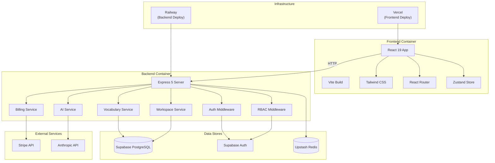
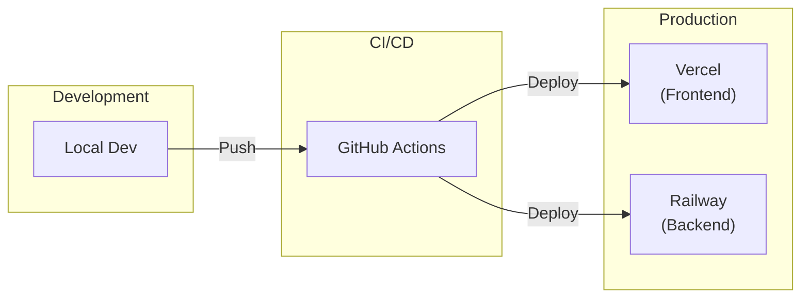

# Container Diagram (C4 Level 2)

## Overview

This diagram shows the high-level technical building blocks of EngineerOS.

## Mermaid Diagram

## Container Details

### Frontend (React App)

| Component | Technology | Purpose |
|-----------|------------|---------|
| UI Framework | React 19 | Component rendering |
| Routing | React Router 7 | Navigation |
| State | Zustand | Client-side state |
| Styling | Tailwind CSS 4 | Responsive design |
| Build | Vite 6 | Fast bundling |

### Backend (Express Server)

| Component | Technology | Purpose |
|-----------|------------|---------|
| HTTP Server | Express 5 | REST API |
| Auth | Supabase Auth | User authentication |
| AI | Anthropic Claude | AI coaching |
| Billing | Stripe | Subscription management |
| Validation | Zod | Input validation |
| Security | Helmet | HTTP headers |

### Data Stores

| Store | Technology | Purpose |
|-------|------------|---------|
| Primary DB | Supabase PostgreSQL | User data, subscriptions |
| Auth | Supabase Auth | Authentication, JWTs |
| Cache | Upstash Redis | Rate limiting, caching |

## Communication Protocols

| Path | Protocol | Port |
|------|----------|------|
| User → Frontend | HTTPS | 443 |
| Frontend → Backend | HTTPS | 443 |
| Backend → Supabase | HTTPS | 443 |
| Backend → Stripe | HTTPS | 443 |
| Backend → Anthropic | HTTPS | 443 |
| Backend → Upstash | HTTPS | 443 |

## Deployment

