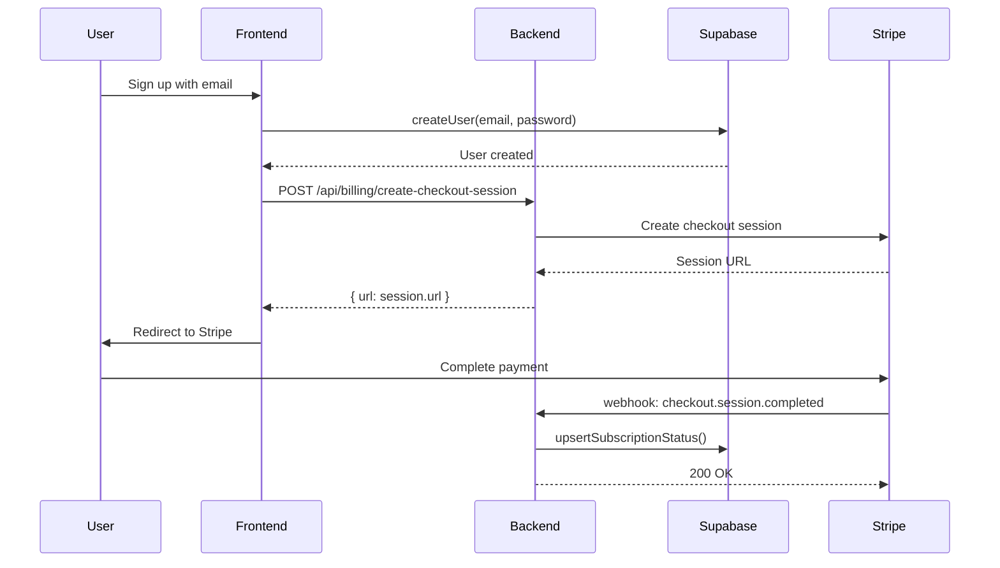
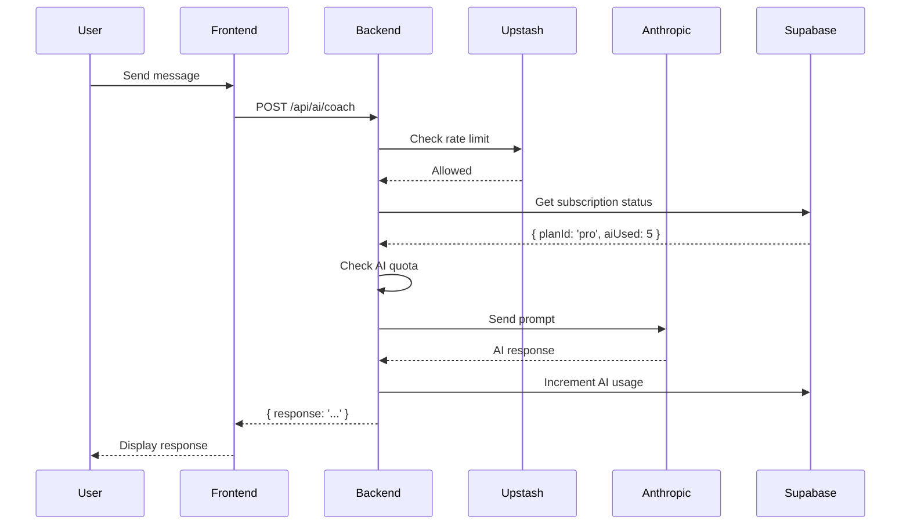
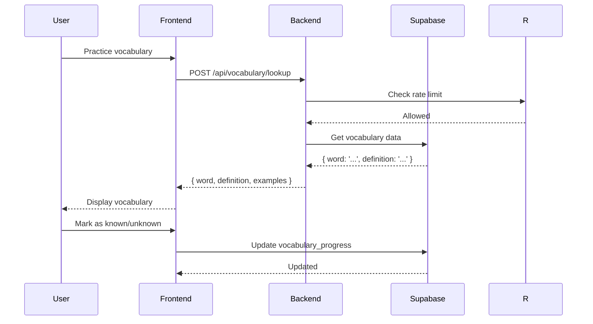
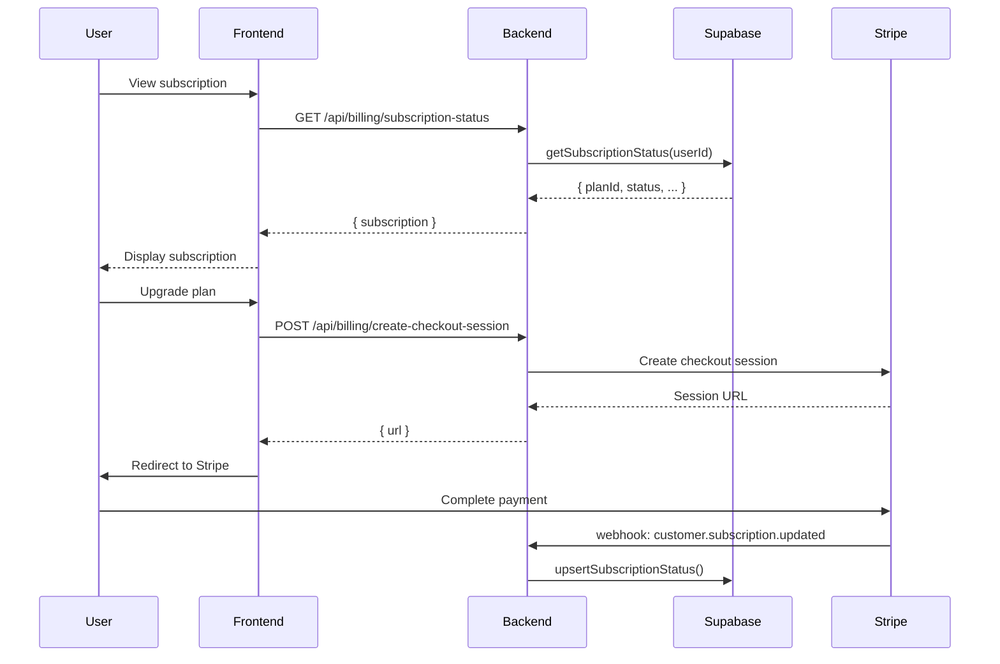
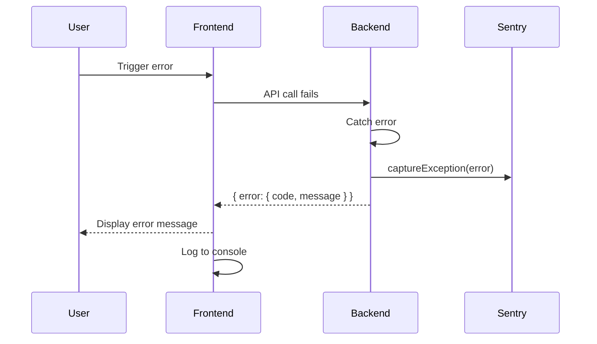

# Data Flow Diagram

## Overview

This document shows how data flows through EngineerOS for key user journeys.

## User Registration Flow

## AI Coaching Flow

## Vocabulary Practice Flow

## Subscription Management Flow

## Error Handling Flow

## Data Storage Patterns

| Data Type | Storage | Backup | Retention |
|-----------|---------|--------|-----------|
| User profiles | Supabase | Daily | Account lifetime |
| Subscriptions | Supabase | Daily | 7 years (billing) |
| Vocabulary progress | Supabase | Daily | Account lifetime |
| AI conversations | Supabase | Daily | 90 days |
| Audit logs | Supabase | Daily | 1 year |
| Rate limit counters | Upstash | None | 24 hours |
