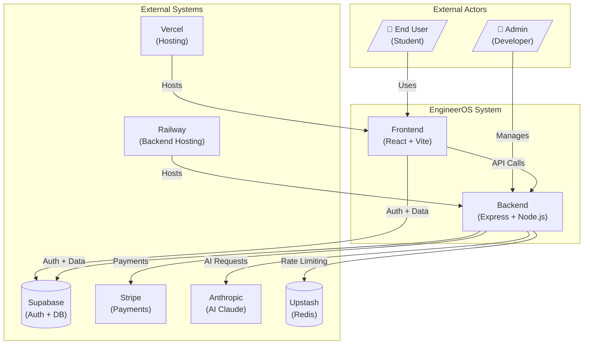

# System Context Diagram (C4 Level 1)

## Overview

This diagram shows the high-level system context of EngineerOS and its interactions with external actors and systems.

## Mermaid Diagram

## Interactions

| Actor/System        | Interaction        | Protocol  |
| ------------------- | ------------------ | --------- |
| User → Frontend     | Web UI access      | HTTPS     |
| Frontend → Backend  | REST API calls     | HTTPS     |
| Frontend → Supabase | Auth + Realtime    | WSS/HTTPS |
| Backend → Supabase  | Data operations    | HTTPS     |
| Backend → Stripe    | Payment processing | HTTPS     |
| Backend → Anthropic | AI inference       | HTTPS     |
| Backend → Upstash   | Rate limiting      | HTTPS     |

## Data Flow

1. User interacts with Frontend
2. Frontend authenticates via Supabase
3. Frontend makes API calls to Backend
4. Backend processes requests
5. Backend interacts with external services
6. Response returned to User

## Security Boundaries

- **Frontend:** Public internet, CDN-cached
- **Backend:** Private network, rate-limited
- **Database:** Encrypted, RLS-protected
- **Secrets:** Environment variables only
