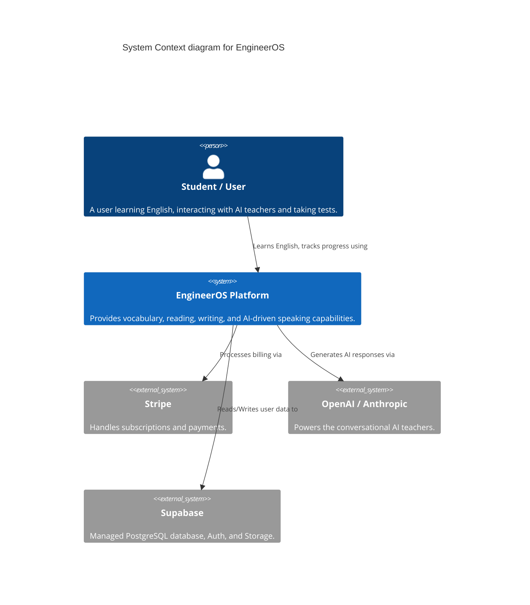
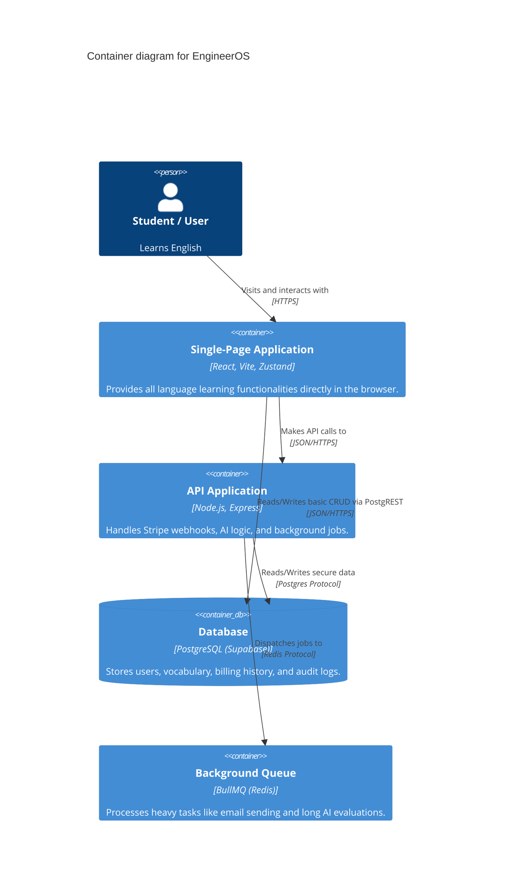

# System Architecture (C4 Model)

## Context Diagram

```mermaid
C4Context
    title System Context diagram for EngineerOS

    Person(user, "Student / User", "A user learning English, interacting with AI teachers and taking tests.")

    System(engineeros, "EngineerOS Platform", "Provides vocabulary, reading, writing, and AI-driven speaking capabilities.")

    System_Ext(stripe, "Stripe", "Handles subscriptions and payments.")
    System_Ext(openai, "OpenAI / Anthropic", "Powers the conversational AI teachers.")
    System_Ext(supabase, "Supabase", "Managed PostgreSQL database, Auth, and Storage.")

    Rel(user, engineeros, "Learns English, tracks progress using")
    Rel(engineeros, stripe, "Processes billing via")
    Rel(engineeros, openai, "Generates AI responses via")
    Rel(engineeros, supabase, "Reads/Writes user data to")
```

## Container Diagram

```mermaid
C4Container
    title Container diagram for EngineerOS

    Person(user, "Student / User", "Learns English")

    Container(spa, "Single-Page Application", "React, Vite, Zustand", "Provides all language learning functionalities directly in the browser.")
    Container(api, "API Application", "Node.js, Express", "Handles Stripe webhooks, AI logic, and background jobs.")
    ContainerDb(db, "Database", "PostgreSQL (Supabase)", "Stores users, vocabulary, billing history, and audit logs.")
    Container(queue, "Background Queue", "BullMQ (Redis)", "Processes heavy tasks like email sending and long AI evaluations.")

    Rel(user, spa, "Visits and interacts with", "HTTPS")
    Rel(spa, api, "Makes API calls to", "JSON/HTTPS")
    Rel(spa, db, "Reads/Writes basic CRUD via PostgREST", "JSON/HTTPS")
    Rel(api, db, "Reads/Writes secure data", "Postgres Protocol")
    Rel(api, queue, "Dispatches jobs to", "Redis Protocol")
```
